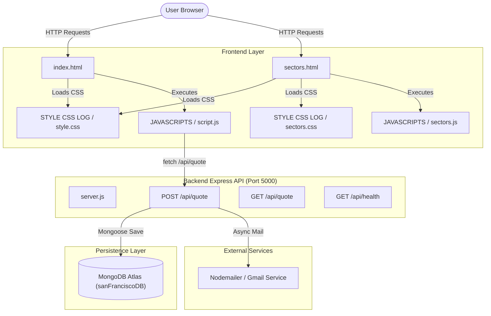
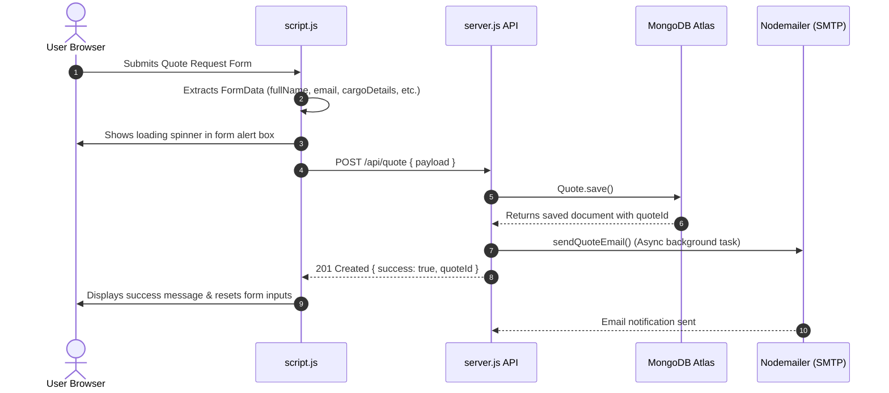

# Code Inspection & Resolution Report

This document provides a visual breakdown, system architecture flowchart, sequence diagram, and detailed matrix of all code issues analyzed and resolved in the **San Francisco Logistics** codebase.

---

## 🗺️ System Architecture & Data Flow

---

## 📊 Summary of Resolved Code Issues

| # | File / Component | Category | Issue Description | Solution Implemented | Status |
|---|---|---|---|---|---|
| 1 | index.html | Paths & Links | Asset links used `../` relative paths (`../STYLE CSS LOG/style.css`, `../VIDEOS/...`, `../JAVASCRIPTS/...`), causing 404 errors. | Updated all asset links to root-relative paths (`STYLE CSS LOG/`, `VIDEOS/`, `JAVASCRIPTS/`). | ✅ Fixed |
| 2 | sectors.html | Paths & Links | CSS and JS tags contained `../` paths, preventing styles and dynamic sector scripts from loading. | Fixed all stylesheet and script tag paths to point to project root directories. | ✅ Fixed |
| 3 | index.html & sectors.html | Forms & Validation | Quote form inputs lacked `name` attributes (`name="email"`, `name="fullName"`, etc.), causing unpredictable payload generation. | Added exact `name` attributes to all quote request forms across both pages. | ✅ Fixed |
| 4 | script.js | JS Logic & UX | Tab quote form lacked alert container; modal closing logic executed even when modal was inactive. | Updated `handleQuoteSubmit` to use `FormData`, dynamically locate form alert elements, and conditionally close modals. | ✅ Fixed |
| 5 | sectors.js | JS Search & Filter | Live search input and category pill filters operated out of sync, leaving hidden container blocks visible. | Integrated category filter reset with search input listeners, ensuring `.segment-block` containers sync correctly. | ✅ Fixed |
| 6 | server.js | Backend & Security | Trailing comma in recipient list when `GMAIL_USER` was empty caused Nodemailer email send errors. | Sanitized recipient array with `.filter(Boolean)` and added `.catch()` error handling to background email promises. | ✅ Fixed |
| 7 | server.js | Routing | Catch-all `*` route returned HTML even for broken `/api/*` endpoints. | Added explicit `/api` 404 middleware returning structured JSON error responses. | ✅ Fixed |
| 8 | dockerfile | DevOps / Build | Deprecated `npm install --production` flag in Docker build stage. | Updated flag to modern standard `npm install --omit=dev`. | ✅ Fixed |

---

## 🔄 Quote Request Handling Sequence

---

> [!NOTE]
> All JavaScript files (`server.js`, `script.js`, `sectors.js`) passed syntax verification without errors. The application frontend and backend are fully operational and synchronized.
